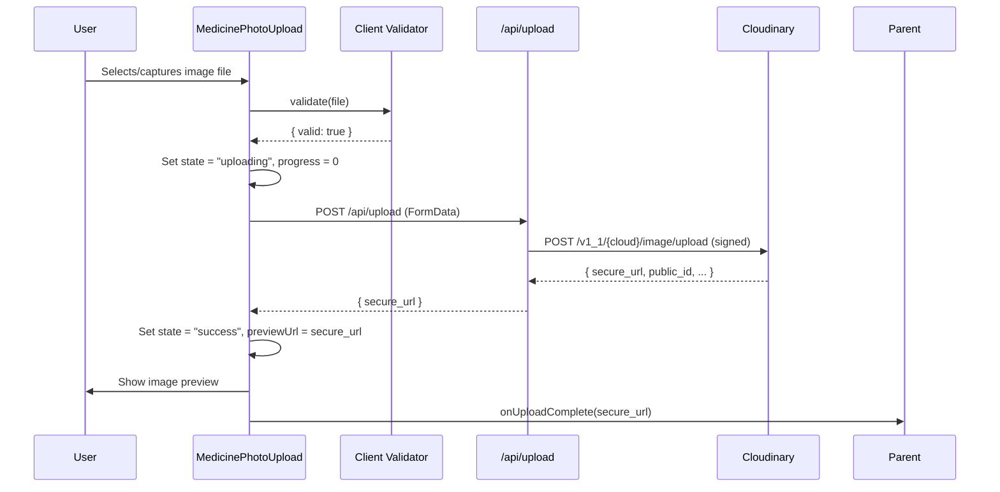
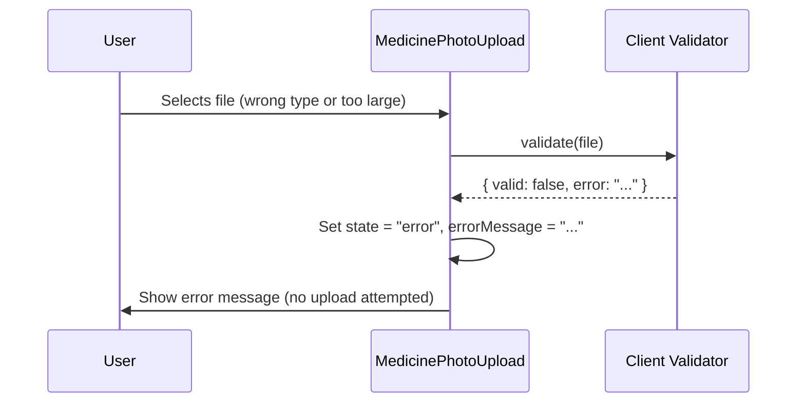

# Design Document: Medicine Photo Upload Component

## Overview

The `MedicinePhotoUpload` component provides a reusable, mobile-friendly interface for citizens to photograph or select medicine packaging images and upload them to Cloudinary. It integrates with the existing `/api/upload` Next.js route, validates files client-side before upload, shows real-time progress, displays a post-upload preview, and returns the Cloudinary secure URL to the parent component for downstream AI-powered fake medicine detection.

The component is designed as a drop-in addition to `apps/web/components/` following the same patterns established by `BarcodeScanner` and `ActionCard` — client-only, Tailwind-styled, WCAG-accessible, and fully typed in TypeScript.

## Architecture

```mermaid
graph TD
    A[Parent Component / ChatUI] -->|renders| B[MedicinePhotoUpload]
    B -->|file selected / captured| C[Client-Side Validator]
    C -->|valid file| D[Upload State Machine]
    C -->|invalid file| E[Error Display]
    D -->|FormData POST| F[/api/upload Next.js Route]
    F -->|signed request| G[Cloudinary REST API]
    G -->|secure_url| F
    F -->|secure_url| D
    D -->|onUploadComplete callback| A
    D -->|renders| H[Progress Indicator]
    D -->|renders| I[Image Preview]
```

## Sequence Diagrams

### Happy Path: File Selected and Uploaded



### Validation Failure Path



## Components and Interfaces

### Component: `MedicinePhotoUpload`

**Purpose**: Top-level exported component. Orchestrates file selection, validation, upload, progress display, preview, and error handling.

**Location**: `apps/web/components/medicine/MedicinePhotoUpload.tsx`

**Interface**:

```typescript
interface MedicinePhotoUploadProps {
    /** Called with the Cloudinary secure URL after a successful upload. */
    onUploadComplete: (secureUrl: string) => void;
    /** Optional callback when an error occurs (validation or upload). */
    onError?: (error: string) => void;
    /** Optional label override for the upload button. Defaults to "Upload Medicine Photo". */
    label?: string;
    /** Whether the component is disabled (e.g. while parent is processing). */
    disabled?: boolean;
}
```

**Responsibilities**:

- Render the file input trigger (button + hidden `<input type="file">` without the `multiple` attribute)
- Delegate validation to `validateMedicineFile`
- Manage upload state machine transitions
- Render the appropriate sub-view based on current state
- Invoke `onUploadComplete` with the returned URL
- Render an `aria-live="polite"` status region that announces state changes (e.g. "Upload complete", "Upload failed: …") to screen readers
- Disable the upload button and file input while `state.status === "uploading"` to prevent concurrent uploads

---

### Component: `UploadDropzone` (internal)

**Purpose**: The interactive drop/select area shown in the `idle` state. Supports both click-to-select and drag-and-drop file selection.

**Interface**:

```typescript
interface UploadDropzoneProps {
    onFileSelected: (file: File) => void;
    disabled: boolean;
    label: string;
    inputId: string;
}
```

**Responsibilities**:

- Render a styled button/zone that triggers the hidden `<input type="file">` on click or Enter/Space keypress
- The `<input type="file">` does **not** have the `multiple` attribute — only a single file can be selected at a time
- Accept `accept="image/jpeg,image/png,image/webp"` and `capture="environment"` for mobile camera
- Handle drag-and-drop events for desktop interactions:
    - `dragover`: call `event.preventDefault()` and apply a visual highlight (e.g. `border-blue-500` Tailwind class) to indicate the drop target is active
    - `dragleave`: remove the highlight class when the drag leaves the dropzone boundary
    - `drop`: call `event.preventDefault()`, extract `event.dataTransfer.files`. If `files.length > 1`, only the first file (`files[0]`) is used — additional files are silently discarded. (Optionally, a brief inline notice such as "Only one file can be uploaded at a time" may be shown, but the first file is still accepted.)
- Be keyboard-navigable: the dropzone element has `tabIndex={0}` and responds to `keydown` events for `Enter` and `Space` by programmatically triggering the file input
- Carry an `aria-label` describing its purpose (e.g. `"Upload medicine photo — click or drag and drop"`)
- When `disabled === true`, the button and file input are both disabled and drag-and-drop events are ignored

---

### Component: `UploadProgressBar` (internal)

**Purpose**: Animated progress bar shown during upload.

**Interface**:

```typescript
interface UploadProgressBarProps {
    /** 0–100 */
    progress: number;
}
```

**Responsibilities**:

- Render a visual progress bar with `role="progressbar"`, `aria-label="Upload progress"`, `aria-valuenow={progress}`, `aria-valuemin={0}`, and `aria-valuemax={100}`
- Show percentage text alongside the bar for sighted users

---

### Component: `ImagePreview` (internal)

**Purpose**: Displays the uploaded image and a "Remove / Re-upload" action.

**Interface**:

```typescript
interface ImagePreviewProps {
    src: string;
    onRemove: () => void;
}
```

**Responsibilities**:

- Render `` with `alt="Uploaded medicine packaging"`
- Provide a remove button with a descriptive `aria-label` (e.g. `aria-label="Remove uploaded photo"`) to reset state back to `idle`
- If a local `blob:` URL was created via `URL.createObjectURL` for an interim preview, call `URL.revokeObjectURL(blobUrl)` when the preview changes or when the component unmounts, to prevent memory leaks. (The current design uses the Cloudinary `secure_url` for the post-upload preview, so this applies only if a local preview is added in future.)

---

### Utility: `validateMedicineFile`

**Location**: `apps/web/components/medicine/validateMedicineFile.ts`

**Interface**:

```typescript
type ValidationResult = { valid: true } | { valid: false; error: string };

function validateMedicineFile(file: File): ValidationResult;
```

**Responsibilities**:

- Check MIME type is one of `image/jpeg`, `image/png`, `image/webp`
- Check file size does not exceed 5 MB (5 × 1024 × 1024 bytes)
- Return a typed discriminated union result

---

### Hook: `useUpload`

**Location**: `apps/web/components/medicine/useUpload.ts`

**Interface**:

```typescript
type UploadState =
    | { status: "idle" }
    | { status: "uploading"; progress: number }
    | { status: "success"; secureUrl: string }
    | { status: "error"; message: string };

interface UseUploadReturn {
    state: UploadState;
    upload: (file: File) => Promise<void>;
    /** Aborts any in-flight XHR and resets state to "idle". */
    reset: () => void;
    /** Cancels an in-flight upload without resetting to idle (e.g. for explicit user cancellation mid-upload). Internally calls xhr.abort(). */
    cancel: () => void;
}

function useUpload(onUploadComplete: (url: string) => void): UseUploadReturn;
```

**Responsibilities**:

- POST the file to `/api/upload` via `XMLHttpRequest` for real progress events
- Track the active `XMLHttpRequest` instance in a ref so it can be aborted
- Transition state machine: `idle → uploading → success | error`
- Call `onUploadComplete` on success
- Expose `reset()` to abort any in-flight XHR and return to `idle`
- Expose `cancel()` to call `xhr.abort()` on the active request, transitioning to `idle` (distinct from `reset()` which is also used post-error)
- Abort the XHR on component unmount via the `useEffect` cleanup function

## Data Models

### `UploadState` (discriminated union)

```typescript
type UploadState =
    | { status: "idle" }
    | { status: "uploading"; progress: number } // progress: 0–100
    | { status: "success"; secureUrl: string } // Cloudinary HTTPS URL
    | { status: "error"; message: string }; // user-facing error string
```

**Validation Rules**:

- `progress` must be an integer in `[0, 100]`
- `secureUrl` must start with `https://res.cloudinary.com/`
- `message` must be a non-empty, human-readable string

### `ValidationResult`

```typescript
type ValidationResult = { valid: true } | { valid: false; error: string };
```

**Validation Rules**:

- Accepted MIME types: `image/jpeg`, `image/png`, `image/webp`
- Maximum file size: `5 * 1024 * 1024` bytes (5 MB)

## Algorithmic Pseudocode

### Main Upload Algorithm

```typescript
async function upload(file: File): Promise<void> {
    // Precondition: file has already passed validateMedicineFile
    // Precondition: state.status === "idle" (enforced by disabling input during upload)
    setState({ status: "uploading", progress: 0 });

    const formData = new FormData();
    formData.append("file", file);

    // Use XMLHttpRequest for real progress events and abort support
    const xhr = new XMLHttpRequest();
    xhrRef.current = xhr; // store ref so reset() / cancel() can call xhr.abort()

    xhr.upload.addEventListener("progress", (event) => {
        if (event.lengthComputable) {
            const pct = Math.round((event.loaded / event.total) * 100);
            setState({ status: "uploading", progress: pct });
        }
    });

    const result = await new Promise<{ secure_url: string }>((resolve, reject) => {
        xhr.open("POST", "/api/upload");
        xhr.onload = () => {
            if (xhr.status >= 200 && xhr.status < 300) {
                resolve(JSON.parse(xhr.responseText));
            } else {
                const body = JSON.parse(xhr.responseText);
                reject(new Error(body.error || "Upload failed"));
            }
        };
        xhr.onerror = () => reject(new Error("Network error during upload"));
        // xhr.abort() triggers onabort; treat as a user-initiated cancellation
        xhr.onabort = () => reject(new Error("Upload cancelled"));
        xhr.send(formData);
    });

    // Postcondition: result.secure_url is a valid Cloudinary HTTPS URL
    setState({ status: "success", secureUrl: result.secure_url });
    onUploadComplete(result.secure_url);
}

function cancel(): void {
    // Calls xhr.abort() on the active request; transitions state to "idle"
    xhrRef.current?.abort();
    xhrRef.current = null;
    setState({ status: "idle" });
}
```

**Preconditions**:

- `file` is a `File` object that has passed `validateMedicineFile`
- `state.status === "idle"` — the upload button and file input are disabled while `state.status === "uploading"`, preventing concurrent calls
- `/api/upload` route is reachable and Cloudinary credentials are configured

**Postconditions**:

- On success: `state.status === "success"` and `onUploadComplete` has been called with a non-empty HTTPS URL
- On failure: `state.status === "error"` and `state.message` is a human-readable string
- On cancellation (`xhr.abort()`): `state.status === "idle"` and `onUploadComplete` is not called
- `state.status` is never left as `"uploading"` after the promise settles

**Loop Invariants**: N/A (no loops; progress events are event-driven)

---

### Validation Algorithm

```typescript
function validateMedicineFile(file: File): ValidationResult {
    const ALLOWED_TYPES = new Set(["image/jpeg", "image/png", "image/webp"]);
    const MAX_SIZE_BYTES = 5 * 1024 * 1024; // 5 MB

    // Precondition: file is a non-null File object
    if (!ALLOWED_TYPES.has(file.type)) {
        return {
            valid: false,
            error: "Only JPG, PNG, and WebP images are supported.",
        };
    }

    if (file.size > MAX_SIZE_BYTES) {
        return {
            valid: false,
            error: `File is too large. Maximum size is 5 MB (your file: ${(file.size / 1024 / 1024).toFixed(1)} MB).`,
        };
    }

    return { valid: true };
    // Postcondition: returns { valid: true } iff file.type ∈ ALLOWED_TYPES AND file.size ≤ MAX_SIZE_BYTES
}
```

**Preconditions**:

- `file` is a non-null `File` object (guaranteed by browser file input)

**Postconditions**:

- Returns `{ valid: true }` if and only if both type and size constraints are satisfied
- Returns `{ valid: false, error }` with a descriptive, user-facing message otherwise
- No side effects; pure function

## Key Functions with Formal Specifications

### `validateMedicineFile(file: File): ValidationResult`

**Preconditions**:

- `file !== null && file !== undefined`
- `file` is a browser `File` instance with `.type` (string) and `.size` (number) properties

**Postconditions**:

- `result.valid === true` iff `file.type ∈ {"image/jpeg","image/png","image/webp"}` AND `file.size ≤ 5242880`
- `result.valid === false` implies `result.error` is a non-empty, human-readable string
- Function is pure — no mutations, no I/O

**Loop Invariants**: N/A

---

### `useUpload(onUploadComplete).upload(file: File): Promise<void>`

**Preconditions**:

- `validateMedicineFile(file).valid === true`
- `state.status === "idle"` (the upload button and file input are disabled while `state.status === "uploading"`, making concurrent calls impossible in normal usage)

**Postconditions**:

- On resolution: `state.status === "success"` AND `state.secureUrl` starts with `"https://"`
- On rejection: `state.status === "error"` AND `state.message` is non-empty
- On abort: `state.status === "idle"` AND `onUploadComplete` is not called
- `onUploadComplete` is called exactly once on success, never on failure or cancellation

**Loop Invariants**: N/A

---

### `useUpload(onUploadComplete).reset(): void`

**Preconditions**: None (callable from any state)

**Postconditions**:

- `state.status === "idle"`
- If `state.status` was `"uploading"`, the active XHR is aborted via `xhr.abort()` before state is reset
- `xhrRef.current` is set to `null`

---

### `useUpload(onUploadComplete).cancel(): void`

**Preconditions**: Intended for use when `state.status === "uploading"`, but safe to call from any state

**Postconditions**:

- `xhr.abort()` is called on the active XHR instance (if any)
- `state.status === "idle"`
- `onUploadComplete` is not called

## Example Usage

```typescript
// In ChatUI.tsx or a verify-medicine page
import { MedicinePhotoUpload } from "@/components/medicine/MedicinePhotoUpload";

function VerifyMedicinePage() {
  const [cloudinaryUrl, setCloudinaryUrl] = useState<string | null>(null);

  const handleUploadComplete = (url: string) => {
    setCloudinaryUrl(url);
    // Pass url to AI detection pipeline
    fetch("/api/detect-fake-medicine", {
      method: "POST",
      body: JSON.stringify({ imageUrl: url }),
    });
  };

  return (
    <div className="p-4">
      <MedicinePhotoUpload
        onUploadComplete={handleUploadComplete}
        label="Upload Medicine Photo"
      />
      {cloudinaryUrl && (
        <p className="mt-2 text-sm text-slate-500">
          Analysing: {cloudinaryUrl}
        </p>
      )}
    </div>
  );
}
```

## Correctness Properties

_A property is a characteristic or behavior that should hold true across all valid executions of a system — essentially, a formal statement about what the system should do. Properties serve as the bridge between human-readable specifications and machine-verifiable correctness guarantees._

### Property 1: Validation type safety

_For any_ file `f`, if `validateMedicineFile(f).valid === true`, then `f.type ∈ {"image/jpeg","image/png","image/webp"}` AND `f.size ≤ 5,242,880` bytes.

**Validates: Requirements 2.1, 2.3, 2.5**

### Property 2: No upload on invalid file

_For any_ file `f` where `validateMedicineFile(f).valid === false`, the MedicinePhotoUpload component SHALL NOT initiate any XHR request and `onUploadComplete` SHALL NOT be called.

**Validates: Requirements 2.6, 5.3**

### Property 3: State machine completeness

_For any_ upload attempt, the upload state machine always terminates in either `"success"` or `"error"` — it never remains in `"uploading"` after the XHR settles (resolves, rejects, or aborts).

**Validates: Requirements 1.1, 12.2**

### Property 4: Callback exactly once on success

_For any_ successful upload, `onUploadComplete` is called exactly once with the Cloudinary `secure_url`, and is never called on failure, validation error, or cancellation.

**Validates: Requirements 5.1, 5.2, 5.3, 5.4**

### Property 5: URL integrity

_For any_ state where `state.status === "success"`, `state.secureUrl` is a non-empty string beginning with `"https://res.cloudinary.com/"`.

**Validates: Requirements 5.5**

### Property 6: Reset idempotency

_For any_ upload state (idle, uploading, success, or error), calling `reset()` always results in `state.status === "idle"` and `xhrRef.current === null`.

**Validates: Requirements 13.3**

### Property 7: No secret leakage

_For any_ execution of the MedicinePhotoUpload component, the component never reads or exposes `CLOUDINARY_API_KEY` or `CLOUDINARY_API_SECRET`; all signing is performed server-side in the Upload_Route.

**Validates: Requirements 10.2**

### Property 8: No concurrent uploads

_For any_ state where `state.status === "uploading"`, the upload button and file input are disabled and `upload()` is a no-op, making concurrent upload calls impossible.

**Validates: Requirements 14.1, 14.2, 14.3**

### Property 9: Retry is always manual

_For any_ upload failure, no automatic retry is attempted. The component transitions to `error` state and waits for explicit user action via the "Try again" button.

**Validates: Requirements 13.1, 13.2**

## Error Handling

### Error Scenario 1: Invalid File Type

**Condition**: User selects a file with MIME type not in `{"image/jpeg","image/png","image/webp"}` (e.g. PDF, GIF, HEIC).
**Response**: `validateMedicineFile` returns `{ valid: false, error: "Only JPG, PNG, and WebP images are supported." }`. Component transitions to `error` state and displays the message inline. No network request is made.
**Recovery**: User dismisses the error (or it auto-clears) and selects a valid file.

### Error Scenario 2: File Too Large

**Condition**: User selects a file exceeding 5 MB.
**Response**: `validateMedicineFile` returns `{ valid: false, error: "File is too large. Maximum size is 5 MB (your file: X.X MB)." }`. Same inline error display, no upload.
**Recovery**: User selects a smaller file.

### Error Scenario 3: Network / Server Error

**Condition**: `/api/upload` returns a non-2xx status or the XHR fires `onerror`.
**Response**: Component transitions to `{ status: "error", message: <server error message or "Network error during upload"> }`. Error is displayed with a "Try again" button.
**Recovery**: User clicks "Try again", which calls `reset()` (returning to `idle`) and then programmatically re-opens the file picker so the user can re-select their file. There is **no automatic retry** — all retries are manual and user-initiated.

> **Retry policy**: Manual retry only. The component never retries automatically. The "Try again" button is the sole retry mechanism. It calls `reset()` followed by a programmatic click on the hidden `<input type="file">` to re-open the file picker.

### Error Scenario 4: Missing Cloudinary Credentials (Server)

**Condition**: `CLOUDINARY_CLOUD_NAME`, `CLOUDINARY_API_KEY`, or `CLOUDINARY_API_SECRET` are not set in the server environment.
**Response**: `/api/upload` returns `{ error: "Server is missing Cloudinary credentials." }` with HTTP 500. Component shows a generic "Upload service unavailable" message.
**Recovery**: Operator configures the missing environment variables per `.env.example`.

## Testing Strategy

### Unit Testing Approach

Test `validateMedicineFile` exhaustively with boundary values:

- Valid: `image/jpeg` at exactly 5 MB → `{ valid: true }`
- Invalid type: `image/gif` → `{ valid: false }`
- Invalid size: 5 MB + 1 byte → `{ valid: false }`
- Edge: `image/webp` at 0 bytes → `{ valid: true }` (size check passes; type check passes)

Test `useUpload` hook with mocked `XMLHttpRequest`:

- Verify state transitions: `idle → uploading → success`
- Verify state transitions: `idle → uploading → error`
- Verify `onUploadComplete` is called exactly once on success
- Verify `reset()` aborts in-flight XHR and returns to `idle`

### Property-Based Testing Approach

**Property Test Library**: `fast-check`

Properties to test with `fast-check`:

```typescript
// Property 1: validateMedicineFile is pure and total
fc.assert(
    fc.property(fc.record({ type: fc.string(), size: fc.nat() }), (fileProps) => {
        const result = validateMedicineFile(fileProps as unknown as File);
        return result.valid === true || (result.valid === false && result.error.length > 0);
    })
);

// Property 2: Only allowed types pass type validation
fc.assert(
    fc.property(
        fc.string().filter((t) => !["image/jpeg", "image/png", "image/webp"].includes(t)),
        (badType) => {
            const file = { type: badType, size: 100 } as File;
            return validateMedicineFile(file).valid === false;
        }
    )
);

// Property 3: Files over 5MB always fail
fc.assert(
    fc.property(fc.integer({ min: 5 * 1024 * 1024 + 1, max: 100 * 1024 * 1024 }), (size) => {
        const file = { type: "image/jpeg", size } as File;
        return validateMedicineFile(file).valid === false;
    })
);
```

### Integration Testing Approach

- Mount `MedicinePhotoUpload` in a Jest + jsdom environment with a mocked `/api/upload` handler
- Simulate file selection via `fireEvent.change` on the hidden `<input type="file">`
- Assert progress bar appears during upload
- Assert image preview renders after mock success response
- Assert `onUploadComplete` is called with the mocked URL
- Assert error message renders when mock returns HTTP 500

## Performance Considerations

- **No Cloudinary Upload Widget JS bundle**: The component uses the existing `/api/upload` server route with `XMLHttpRequest` rather than loading the Cloudinary Upload Widget script (~150 KB). This keeps the client bundle lean.
- **Client-side validation before upload**: File type and size are checked synchronously before any network request, preventing wasted bandwidth on invalid files.
- **Image preview via Cloudinary URL**: After a successful upload, the preview uses the returned Cloudinary `secure_url` (already optimised and served from Cloudinary's CDN). This is **not** a local `blob:` URL — no `URL.createObjectURL` is called for the post-upload preview, so no `URL.revokeObjectURL` cleanup is needed for that case.

    > **Note on interim blob previews**: If a future iteration adds an instant local preview before the upload completes (e.g. showing a thumbnail immediately after file selection using `URL.createObjectURL(file)`), that blob URL **must** be revoked with `URL.revokeObjectURL(blobUrl)` when the preview changes or the component unmounts, to avoid memory leaks. This is not part of the current design but is called out here as a constraint for any future enhancement.

- **XHR abort on unmount**: The `useUpload` hook stores the active `XMLHttpRequest` in a ref and calls `xhr.abort()` in the `useEffect` cleanup function when the component unmounts, preventing state updates on unmounted components and releasing the connection.
- **Double-upload prevention**: The upload button and file input are both set to `disabled` while `state.status === "uploading"`. This is enforced at the component level — `UploadDropzone` receives `disabled={state.status === "uploading"}` and ignores drag-and-drop events when disabled.

## Security Considerations

- **No client-side secrets**: `CLOUDINARY_API_KEY` and `CLOUDINARY_API_SECRET` are server-only environment variables. The component only calls `/api/upload` — it never touches Cloudinary directly.
- **Server-side signature**: The existing `/api/upload` route generates a SHA-1 HMAC signature server-side before forwarding to Cloudinary, preventing unsigned uploads.
- **MIME type validation**: Client-side MIME type check uses `file.type` (browser-reported). The server-side Cloudinary upload also enforces allowed formats, providing defence-in-depth.
- **File size cap**: 5 MB client-side limit reduces bandwidth abuse; Cloudinary's own upload limits provide a second layer.
- **No `NEXT_PUBLIC_` Cloudinary secrets**: Only `NEXT_PUBLIC_CLOUDINARY_CLOUD_NAME` (non-secret) may be exposed to the client if needed for preview URL construction; API key and secret remain server-only.
- **WCAG / XSS**: Image `alt` text is static and controlled; no user-supplied strings are rendered as HTML.

## Accessibility

The component is designed to meet WCAG 2.1 AA. Full validation requires manual testing with assistive technologies.

### Keyboard Interaction

- The `UploadDropzone` element has `tabIndex={0}` and handles `keydown` events for `Enter` and `Space`, programmatically triggering the hidden `<input type="file">`. This mirrors the native button behaviour expected by keyboard users.
- The upload trigger must be a `<button>` element or a `<label htmlFor="...">` pointing to the hidden `<input type="file">` — never a plain `<div>` or `<span>`. This ensures the element is natively keyboard-focusable and activatable without extra ARIA.
- The "Try again" button in the error state is a standard `<button>` element and is keyboard-focusable by default.
- The "Remove / Re-upload" button in the success state is likewise a standard `<button>`.

### Hidden File Input Label

The hidden `<input type="file">` must have an associated visually-hidden `<label>` element (not just an `aria-label` on the surrounding button). This ensures screen readers announce the input correctly when it receives focus:

```tsx
<label htmlFor={inputId} className="sr-only">
  Upload medicine photo
</label>
<input
  id={inputId}
  type="file"
  accept="image/jpeg,image/png,image/webp"
  capture="environment"
  className="sr-only"
  tabIndex={-1}
  aria-hidden="true"
/>
```

The `aria-hidden="true"` on the `<input>` prevents double-announcement when the visible button/dropzone already describes the action; the `<label>` remains in the accessibility tree for programmatic association.

### ARIA Attributes

| Element                     | ARIA attribute(s)    | Value / Notes                                                                                                           |
| --------------------------- | -------------------- | ----------------------------------------------------------------------------------------------------------------------- |
| `UploadDropzone`            | `aria-label`         | `"Upload medicine photo — click or drag and drop"` (or the `label` prop value)                                          |
| `UploadDropzone`            | `aria-disabled`      | `"true"` when `disabled === true`                                                                                       |
| `UploadProgressBar`         | `role="progressbar"` | Always present during upload                                                                                            |
| `UploadProgressBar`         | `aria-label`         | `"Upload progress"`                                                                                                     |
| `UploadProgressBar`         | `aria-valuenow`      | Current progress integer (0–100)                                                                                        |
| `UploadProgressBar`         | `aria-valuemin`      | `0`                                                                                                                     |
| `UploadProgressBar`         | `aria-valuemax`      | `100`                                                                                                                   |
| Status region               | `aria-live="polite"` | Wraps the status/error message area; announces changes without interrupting the user                                    |
| Error message container     | `role="alert"`       | Causes screen readers to announce the error immediately when it appears, without waiting for the user to navigate to it |
| `ImagePreview` ``      | `alt`                | `"Uploaded medicine packaging"`                                                                                         |
| "Remove / Re-upload" button | `aria-label`         | `"Remove uploaded photo"` — descriptive label so screen readers announce the action clearly                             |
| "Try again" button          | `aria-label`         | `"Try uploading again"` — descriptive label for the retry action                                                        |

### Live Region for Status Messages

`MedicinePhotoUpload` renders a visually-styled (and optionally visually-hidden) `<div aria-live="polite">` that reflects the current upload status. Screen readers announce changes to this region automatically:

| State                | Announced text                                           |
| -------------------- | -------------------------------------------------------- |
| `uploading`          | `"Uploading… {progress}%"` (updated as progress changes) |
| `success`            | `"Upload complete"`                                      |
| `error`              | `"Upload failed: {message}"`                             |
| `idle` (after reset) | `""` (empty — clears the previous announcement)          |

### Drag-and-Drop Accessibility

Drag-and-drop is an enhancement for pointer/mouse users. Keyboard and touch users can always use the click-to-select path. The dropzone does not rely solely on drag-and-drop for any functionality.

## Dependencies

| Dependency          | Version   | Purpose                                                  |
| ------------------- | --------- | -------------------------------------------------------- |
| `next`              | `^16.2.6` | App Router, API routes                                   |
| `react`             | `^19.2.6` | Component rendering                                      |
| `lucide-react`      | `^1.16.0` | Upload, Camera, CheckCircle, AlertCircle icons           |
| `tailwindcss`       | `^4.2.4`  | Utility-first styling                                    |
| Cloudinary REST API | v1        | Image storage and CDN (via existing `/api/upload` route) |
| `fast-check`        | (dev)     | Property-based testing                                   |

No new runtime dependencies are required. The component relies entirely on the browser's native `XMLHttpRequest`, `File`, `FormData`, and `FileReader` APIs alongside existing project dependencies.
